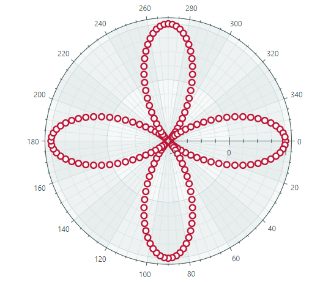
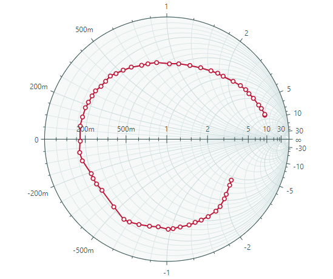

# Charts

The Eremex Controls Library for Avalonia UI includes powerful chart controls that help you visualize data as 2D charts. The chart controls' graphics rendering is optimized to display large data. The controls maintain high performance even when series contain millions of points.

## CartesianChart

Allows you to plot a diagram on a Cartesian coordinate system.

### Features

- An unlimited number of data series within each chart
- Supported series views: Line, Scatter Line, Point, Area, Step Line, Bar, Range Bar, Candlestick, and more.
- Displaying multiple axes simultaneously
- Swapping X and Y axes
- Reversing axes
- Available axis types: Numeric, Date-Time, Time Span, Qualitative, and Logarithmic
- Scrolling and zooming a View (all axes at the same time)
- Scrolling and zooming individual axes
- High-performance when displaying large data
- Real-time data visualization
- Strips and constant lines
- Empty points (gaps)
- Using the MVVM design pattern to provide data and customize chart options
- Displaying rapidly changing real-time data. Use a special data adapter to implement a moving viewport

### Series Types

* Line Series View
* Scatter Line Series View
* Point Series View (with SVG marker support)
* Area Series View
* Step Line Series View
* Step Area Series View
* Range Area Series View
* Stacked Area Series View
* Full-Stacked Area Series View
* Bar Series View
* Range Bar Series View 
* Candlestick Series View
* Lollipop Series View

### Documentation

- [Cartesian Chart](https://eremexcontrols.net/controls/charts/cartesian-chart/)

## PolarChart

Plots a diagram on a polar coordinate system.

### Features

- Crosshair
- Strips and constant lines
- Using the MVVM design pattern to provide data and customize chart options
- Sweep direction and start angle (for the X axis)

### Series Types

- Point Series View
- Line Series View
- Scatter Line Series View
- Area Series View
- Range Area Series View

## SmithChart

Allows you to create a Smith chart.

### Features

- Crosshair
- Using the MVVM design pattern to provide data and customize chart options

### Series Types

- Point Series View
- Scatter Line Series View

## Documentation

- [Charts](https://eremexcontrols.net/controls/charts/)

