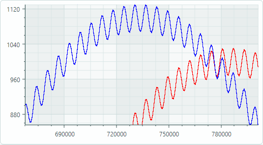

# Charts

The Eremex Controls Library for Avalonia UI includes high-performance `CartesianChart` control that helps you visualize data as a 2D chart. The control supports multiple series Views and an unlimited number of axes. 

The chart's graphics rendering is optimized to display large data. The control provides high performance even when series contain millions of points.

The chart control supports instant display of rapidly changing real-time data. You can use a special data adapter to implement a moving viewport.

## Main Features

* An unlimited number of axes and series within a View.
* Multiple axis types: Numeric, Date-Time, Time Span, Qualitative, and Logarithmic.
* Scrolling and zooming a View (all axes at the same time).
* Scrolling and zooming individual axis.
* High-performance when displaying large data.
* Real-time data visualization.

## Series Types

* Line Series View
* Scatter Line Series View
* Point Series View (with SVG marker support)
* Area Series View
* Step Area Series View
* Range Area Series View
* Bar Series View
* Range Bar Series View 

## Documentation

- [English Documentation](https://eremexcontrols.net/articles/charts.html)

