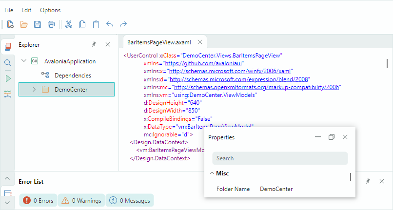

# Docking UI

The **Dock Manager** component shipped as part of the Eremex Avalonia Controls library allows you to implement the classic docking UI found in popular IDEs. You can create tool panels that support dock, auto-hide, and float operations. Special Document containers are designed to display the main content of your window. You can create multiple Documents and combine them in a tabbed UI.

The main features of the Docking library include:

- Visual Studio IDE-inspired UI.
- Dockable tool panels.
- Floating panels.
- Panel auto-hide functionality.
- Panel drag-and-drop and resize operations.
- Docking Hints — When you drag a panel over the Dock Manager's area, dock hints appear. They guide you how to dock the panel at a specific position.
- Integrated support for Documents, which are special containers used to display the main content of your window.
- Combining multiple Documents in a tabbed UI.
- Built-in context commands to perform operations on panels and Documents.
- MVVM support.

## Documentation

- [English Documentation](https://eremexcontrols.net/articles/controls/docking.html)
