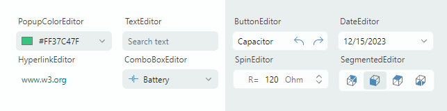

# Editors

The Eremex Controls library includes multiple editors that provide advanced data editing capabilities. The editors allow you to display and edit data of different data types (numeric, Boolean, date-time, enumerations, etc.). They support the data validation mechanism to inform users about errors during data input. 

You can embed the Eremex data editors in cells in container controls (Data Grid, Tree List, Property Grid, and Toolbars/Menus) to present and edit cell data. Any custom control can be embedded in container control cells, but the use of Eremex in-place editors allows you to deliver high-performance UI/UX designs.

 

- `ComboBoxEditor` — Allows a user to select an item from an item list displayed in an associated popup window. 
   - Supported item sources: a list of strings, list of business objects, and an enumeration type.
   - Support for data templates used to render items in a custom manner.
   - Single and multiple item selection modes.
   - Built-in check boxes in multiple selection mode.
   - The text auto-completion feature predicts an item selection when a user starts typing text in the edit box in single selection mode.

 

- `SegmentedEditor` — Displays segments (items), one of which can be selected by a user.
    - Horizontal arrangement of segments.
    - A user can click a segment to select it and unselect other segments.
    - A Ctrl-click on a selected item clears the selection.
    - Supported item sources: a list of strings, list of business objects, and an enumeration type.
    - Use data templates to render items in a custom manner.

 

- `ButtonEditor` —  A text editor with built-in buttons.
    - Regular and toggle buttons.
    - Displaying text and images in buttons.
    - Right and left button alignment.
    - Tooltips.
    - Built-in 'x' button to clear the editor's value.
    - Watermarks.

 

- `CheckEditor` — Displays a check box which is toggled on a click.
    - Supports two (checked and unchecked) or three check states (checked, unchecked and indeterminate).
    - The validation mechanism modifies the appearance of the control to indicate errors.

 

- `PopupColorEditor` — Allows a user to select a color in a popup window.
    - Three color palettes — Default, Standard, Custom.
    - The Default color palette can be initialized in code.
    - The Standard color palette displays predefined standard colors.
    - The Custom color palette allows users to add and modify colors using the built-in Color Picker.
    - Ability to specify colors in the RGB and HSB formats.
        
 

- `DateEditor` — An editor with an embedded dropdown calendar that allows users to pick a date.
    - Built-in 'Today' and 'Clear' buttons.
    - Support for multiple date display formats.
    - Navigation bar in the dropdown calendar allows for browsing through months and years.
    - Three calendar views: month view, year view, and year range view.
    - An option to limit the available date range.

 

- `HyperlinkEditor` — Displays a clickable hyperlink.
    - Allows you to specify a command to handle clicks on a hyperlink.

 

- `PopupEditor` — A text editor with an associated popup window.
    - Allows you to embed any control in the popup.

 

- `SpinEditor` — Allows you to edit numeric values using spin buttons.
    - Built-in spin buttons allow a user to increase and decrease a value.
    - Limiting the available value range.
    - Custom increment value.
    - Displaying custom value prefix and suffix in the edit box.

 

- `TextEditor` — A text editor featuring the base text editing functionality.
    - The ancestor of all text-based Eremex editors.
    - Support for the data validation mechanism used to show errors to users.

 

- `MemoEditor`  — A dropdown text editor.
    - A text editor embedded in the dropdown window.
    - To show the presence of text in the dropdown editor, the control can display a special icon or the first line of the text in the edit box. 

## Common Features

- Masks
    - Text editors support masked input, which prevents users from entering invalid values.
    - Masks can be used to format cell text in container controls in display mode (when text editing is not active).
    - Supported mask types: Numeric and DateTime.
    - DateEditor uses a DateTime input mask by default.
    - SpinEditor uses a Numeric input mask by default.

 

- Eremex Application Themes
    - Eremex application themes allow you to modify the appearance of the Eremex controls.
    - You can apply the Eremex application themes to a set of standard Avalonia controls.
    - Eremex editors support the primary and secondary color variants for each theme. These color variants help you give a slightly different color accent to the editors by changing a single property.

 

- Data Validation
    - The built-in value validation mechanism allows you to show errors to users in all text editors and CheckEditor.
    - Text editors can display validation errors within edit boxes or below them.

## Documentation

- [English Documentation](https://eremexcontrols.net/articles/editors.html)
