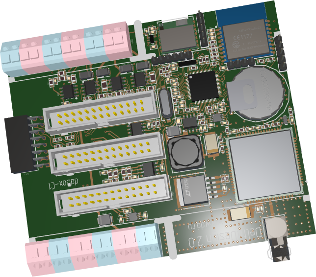

# Graphics3DControl

`Graphics3DControl` allows you to display an interactive 3D model (or multiple models) on a window in your Avalonia application. A user can rotate, pan and zoom the model using the mouse and keyboard.

Use dedicated classes to define a 3D model for the `Graphics3DControl`. These classes allow you to specify vertices, materials (in PBR format), camera, model transformations, etc.

The control's main features include:

- API to specify 3D models
- Simple materials 
- Textured materials in PBR format
- Displaying multiple 3D models simultaneously
- Perspective and isometric camera modes
- Model rotation, panning and zooming with the mouse and keyboard at runtime
- Rendering on a video card with the Vulkan SDK
- MVVM pattern support for specifying 3D models

