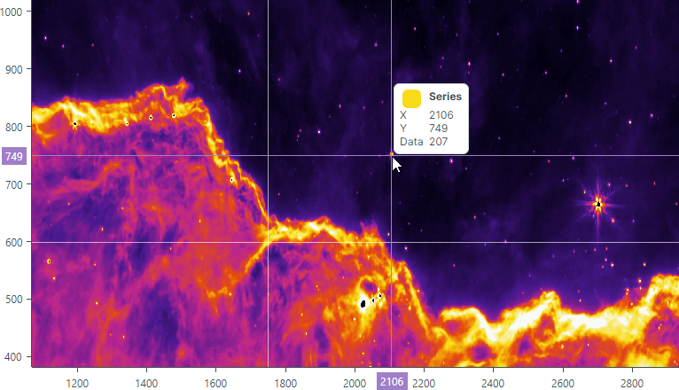
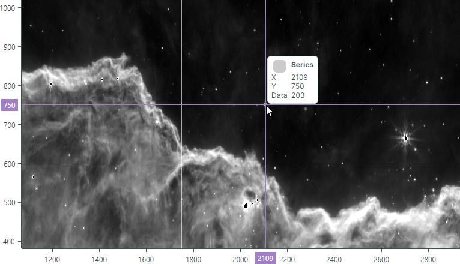

# Heatmap

The **Heatmap** control visualizes numeric data in a matrix using color. Heatmaps are useful for visual analysis of large datasets and locating correlations and anomalies across two variables displayed along the horizontal and vertical axes. 
The color of each data point in a heatmap is determined by the point's numeric value. 

The **Heatmap** control's features include:

- Custom color encoding
- Grayscale colorization
- Customization of the X and Y axes
- Crosshair 
- Strips and constant lines
- Scroll and zoom with the mouse
- Export the result of the data colorization to a bitmap

## Documentation

- [Heatmap](https://eremexcontrols.net/controls/charts/heatmap/)
