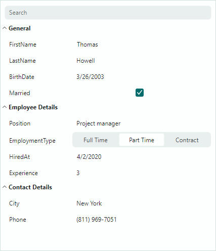

# Property Grid

The `PropertyGridControl` allows a user to browse properties of a single or multiple objects. The control displays public properties and their values of a bound object(s) as a vertical list, and allows a user to edit the property values.

The control's main features include:

- Automatic Creation of Rows — The control can use information provided by the bound object(s) to automatically generate rows.
- Manual Row Creation — You can manually create rows for a specific set of object properties.
- Data Edit Operations — The control uses default Eremex editors to present and edit cell values of common data types. You can embed custom editors in cells to render and edit cell values in a specific manner.
- Data Annotation Attribute Support — The PropertyGrid takes into account dedicated Data Annotation attributes applied to the bound object's properties. You can use Data Annotation attributes to specify custom visibility, read-only state, display name, category and type converter for auto-generated rows.
- Category Rows — Allow you to combine rows into expandable groups.
- Tab Rows — Allow you to combine rows into a tabbed UI.
- Search Panel — Helps a user quickly locate rows by names

## Documentation

- [English Documentation](https://eremexcontrols.net/articles/propertygrid.html)
