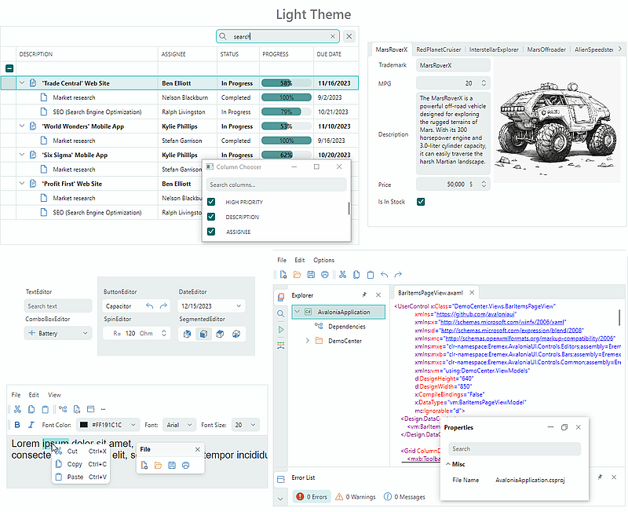

# Eremex Avalonia UI Controls

The Eremex Avalonia Controls Library includes powerful UI controls for the cross-platform Avalonia UI framework to help you deliver cutting-edge applications with enhanced UX.

## About

The Eremex Controls Library ships with advanced controls to meet the most demanding desktop application requirements. The Eremex Grid and Tree List controls feature rich capabilities to display, shape, and edit data from a bound object/data source. The Toolbar Manager and Dock Manager components let you create classic toolbar and docking UIs inspired by popular Office and IDE products. Small controls included in the library, such as data editors, and various utility controls, provide comprehensive data editing and control layout functionality. 

  

## Grids
- [Data Grid](docs/datagrid.md)
- [Tree List and Tree View](docs/treelist.md)
- [Property Grid](docs/propertygrid.md)

## Classic Office and IDE-Inspired UI

- [Toolbars and Menus](docs/toolbars.md)
- [Docking UI](docs/docking.md)

## Editors and Utility Controls
- [Data Editors](docs/editors.md)
- [Utility Controls](docs/commoncontrols.md)

## Themes

The Eremex Avalonia Controls library includes two switchable paint themes that allow you to deliver interfaces with light and dark color palettes. The included themes are also applied to a set of standard Avalonia controls: Button, CalendarControl, CheckBox, Label, ListBox, ProgressBar, RadioButton, Slider, TextBox, and ToolTip.

## The Repository

The current repository contains the Demo project that allows you to get to test all the features of the Eremex Controls for Avalonia UI.
The demo uses the free trial version of the Eremex Avalonia Controls Library. 
The trial version includes all the functionality of the full version, but it displays small watermarks and has some minor restrictions that will not affect your evaluation of the product.

Please contact us via email for information about the full version of the Eremex Avalonia UI Controls.

## Supported Operating Systems

### Windows

- Windows 11
- Windows 10

### Linux

- Ubuntu
- Debian

### Russian Linux-based OSs

- [Astra Linux ](https://astralinux.ru) *
- [RedOS ](https://redos.red-soft.ru) *

* Including OS editions optimized for the Elbrus CPU.

## System Requirements

The following are system requirements to run the current Demo project, and use the Eremex Controls Library for Avalonia UI in your projects.

- [.NET](https://dotnet.microsoft.com/en-us/download/dotnet) 6.0+
- [Avalonia UI Framework](https://avaloniaui.net) v11.0.6+
- Developement: IDEs that have Avalonia UI support (Visual Studio 2022 and higher, JetBrains Rider 2021.3 and higher).

## Get Started

- Clone the repository with the `git clone` command.
- Go to the `DemoCenter/DemoCenter.Desktop` directory for a classic desktop application, or the `DemoCenter/DemoCenter.Web` directory for a Web Assembly project.
- Run the selected project with the `dotnet run` command.

## Product Licensing

The source code included in the current repository is distributed under the terms of the MIT license. 

The Eremex End-User License Agreement (EULA) fully outlines the usage rules of the trial and commercial versions of the Eremex Avalonia Controls Library.

## Contact Us

Have a question or feedback? Please contact us at: https://t.me/emxControls
 
