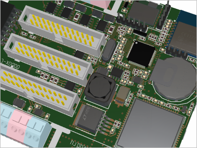

# Eremex Avalonia UI Controls Demo Application

The Eremex Avalonia Controls Library includes a powerful collection of UI controls to help you deliver cutting-edge applications for the cross-platform Avalonia UI framework.
The advanced controls - from Data Grid and Tree List to Charts and Docking UI - provide rich capabilities to visualize, shape, edit data, create classic navigation interfaces, and more. 

 
 

## About

The current repository contains the Demo project that allows you to get to test all the features of the Eremex Controls for Avalonia UI. The demo includes the full-functional version of the Eremex Controls Library, which you can use in your projects for evaluation purposes as long as you need. An unlicensed version of the Library displays trial messages. 

Please [contact us](#contact-us) for information on licensing.

  
<!--  -->

## Data Management Controls

### Data Grid

Displays data from an item source as a two-dimensional table, providing rich data shaping and editing functionality.

 

- Large data sources support
- Unbound data
- Data soring and grouping
- In-place editors
- Search and data filtration
- Data validation
- Built-in and custom context menus
- Styles

[Learn more...](docs/datagrid.md)

### Tree List and Tree View

Renders hierarchical data in the form of a tree. Tree List supports multiple data columns, while Tree View is a single-column control.

 

- Binding to self-referential (flat) and hierarchical data sources
- Unbound mode (allows you to manually supply data)
- Built-in node checkboxes for row selection
- Data sorting
- In-place editors
- Data search and filtering
- Data validation
- Built-in and custom context menus
- Styles

[Learn more...](docs/treelist.md)

### Property Grid

An efficient solution for browsing and editing properties of one or more objects.

  

- Automatic generation of rows from public properties of a bound object(s)
- Manual row creation mode
- Combining rows in categories
- Combining rows in tabs
- Search panel (for quick row location)
- In-place editors

[Learn more...](docs/propertygrid.md)

## Data Visualization Controls

### Chart Controls

The `CartesianChart`, `PolarChart` and `SmithChart` controls allow you to integrate the most popular interactive graphs into your application's UI.

 

- Displaying an unlimited number of data series simultaneously.
- Supported series views: Line, Scatter Line, Point, Area, Step Line, Bar, Range Bar, Candlestick, and more.
- Available axis types: Numeric, Date-Time, Time Span, Qualitative, and Logarithmic
- Scrolling and zooming the entire view and individual axes
- High-performance when displaying large data.
- Real-time data visualization

[Learn more...](docs/charts.md) 

### Heatmap

The Heatmap control allows you to create a two-dimensional [heat map](https://en.wikipedia.org/wiki/Heat_map), a chart that visualizes data using color. The control paints each data point within a 2D "map" with a color that corresponds to a value at this point.

 

- Custom color encoding
- Grayscale colorization
- Customization of the X and Y axes
- Crosshair 
- Strips and constant lines
- Scroll and zoom with the mouse
- Export the result of the data colorization to a bitmap

[Learn more...](docs/charts.md) 

## Navigation and Layout Controls

### Ribbon

The menu inspired by the ribbon UI found in Microsoft Office products.

 

- Simplified and Classic views
- Supported items: small and large buttons, toggle buttons, button groups, sub-menus, and more.
- Inline and dropdown galleries
- Quick Access Toolbar
- Tab colorization
- Keyboard navigation
- Adaptive layout

[Learn more...](docs/ribbon.md)

### Toolbars and Menus

Traditional toolbars and menus for your applications.

 

- Supported toolbar item types: buttons, check buttons, sub-menus, item groups, and more
- Docking toolbars at the edges of a container
- Placing toolbars at any position within the window (for example, at the top of client controls)
- Horizontal and vertical toolbar orientations
- Adaptive layout of commands
- Toolbar layout customization at runtime using drag-and-drop operations
- Runtime customization mode for advanced toolbar personalization
- Quick customization (without the need to activate customization mode)
- Show values in toolbars, and allow users to edit them using in-place editors
- Hotkey support, including complex shortcuts, such as Ctrl+R, Ctrl+K
- Context menus for external controls

[Learn more...](docs/toolbars.md)

### Docking UI

Classic docking interface inspired by the Microsoft Visual Studio IDE.

 

- Dock panels help you create tool panes
- Documents (embedded dock windows) allow you to display the main content of your UI
- Floating panels
- Panel auto-hide functionality
- Tab containers
- Panel resizing and drag-and-drop
- Dock hints
- Built-in context menus to perform operations on panels and Documents
- MVVM support
- Docking on multiple monitors
- Save and restore layouts of dock panels between applicaion runs

[Learn more...](docs/docking.md)

## 3D Graphics

### Graphics3DControl

`Graphics3DControl` can visualize 3D models in your Avalonia applications.

 

- API to specify 3D models
- Simple materials 
- Textured materials in PBR format
- Displaying multiple 3D models simultaneously
- Perspective and isometric camera modes
- Model rotation, panning and zooming with the mouse and keyboard at runtime
- Rendering on a video card with the Vulkan SDK
- MVVM pattern support for specifying 3D models

[Learn more...](docs/graphics3dcontrol.md)

## Editors and Utility Controls

### Data Editors

Simple and advanced editors that allow users to edit almost everything - from text and numbers to date/time values and colors. You can use them as standalone controls, or as in-place editors.

  

- ButtonEditor
- CheckEditor
- ComboBoxEditor
- DateEditor
- HyperlinkEditor
- MemoEditor
- PopupColorEditor
- SegmentedEditor
- SpinEditor
- TextEditor

[Learn more...](docs/editors.md) 

### Utility Controls

A collection of useful controls shipped with the Eremex Controls library allow you to create feature-rich applications.

 

- TabControl
- SplitContainerControl
- GroupBox
- CalendarControl
- MxMessageBox
- CircleProgressIndicator

[Learn more...](docs/commoncontrols.md)

## Themes

The Eremex Controls Library ships with the `Eremex.Avalonia.Themes.DeltaDesign` package that contains the 'DeltaDesign' paint theme for the controls. The 'DeltaDesign' paint theme supports two theme variants that help you deliver interfaces with the light and dark color palettes. The theme is also applied to a set of standard Avalonia controls: Button, CalendarControl, CheckBox, Label, ListBox, ProgressBar, RadioButton, Slider, TextBox, and ToolTip.

| **DeltaDesign Light Theme** | **DeltaDesign Dark Theme** |
|---|---|
|  |  |
|  |  |

## Supported Operating Systems

**Windows**

- Windows 11
- Windows 10

**Linux**

- Ubuntu
- Debian

**Russian Linux-based OSs**

- [Astra Linux ](https://astralinux.ru) *
- [RedOS ](https://redos.red-soft.ru) *

* Including OS editions optimized for the Elbrus CPU.

**macOS**

**WebAssembly**

## System Requirements

The following are system requirements to run the current Demo project, and use the Eremex Controls Library for Avalonia UI in your projects.

- [.NET](https://dotnet.microsoft.com/en-us/download/dotnet) 6.0+
- [Avalonia UI Framework](https://avaloniaui.net) v11.0.6+
- Developement: IDEs that have Avalonia UI support (Visual Studio 2022 and higher, JetBrains Rider 2021.3 and higher).

## Get Started

### Run Demo

- Clone the repository with the `git clone` command.
- Go to the `DemoCenter/DemoCenter.Desktop` directory for a classic desktop application, or the `DemoCenter/DemoCenter.Web` directory for a Web Assembly project.
- Run the selected project with the `dotnet run` command.

### Create New Application

- [Get Started with Eremex Avalonia UI Controls](https://eremexcontrols.net/articles/get-started.html)

### Migrate to Avalonia UI

- [Convert Windows Forms Applications to Avalonia UI](#convert-windows-forms-applications-to-avalonia-ui)

## Documentation

- [English Documentation](https://eremexcontrols.net)
- [Документация на Русском](https://eremexcontrols.net/docsru/)

## Product Licensing

The source code included in the current repository is distributed under the terms of the MIT license. 

The Eremex End-User License Agreement (EULA) fully outlines the usage rules of the Eremex Avalonia UI Controls Library.

## Contact Us

Have a question or feedback? Please contact us at: 

- https://t.me/emxControls (Русский)
- https://t.me/emxControlsEn (English )

## More Resources

### Convert Windows Forms Applications to Avalonia UI

The `WinForms2AvaloniaConverter` tool helps you migrate your existing Windows Forms projects to Avalonia UI. The Converter can convert entire projects or individual files.

- [WinForms2AvaloniaConverter](https://github.com/MICVGLOB/WinForms2AvaloniaConverter)

## Eremex Avalonia UI Controls Gallery

| 

 | 

 | 
| --- | --- | 
| **Data Grid (Dark Theme)**    | **Data Grid (Light Theme)**    | 
| **Data Grid - Grouping**    | **Tree List (Light Theme)**    | 
| **Tree List (Dark Theme)**    | **Tree List - Data Searching**    |
| **Toolbars&Menus (Dark Theme)**    | **Toolbars&Menus (Light Theme)**    | 
| **Editors**    | **Tab Control**    |
| **Property Grid**    | **Property Grid - Inplace Editing**    |
| **Docking (Dark Theme)**    | **Docking (Light Theme)**    | 
| **Charts**    | **Charts (Logarithmic)**    | 
| **Charts (Real-Time Data)**    | |
